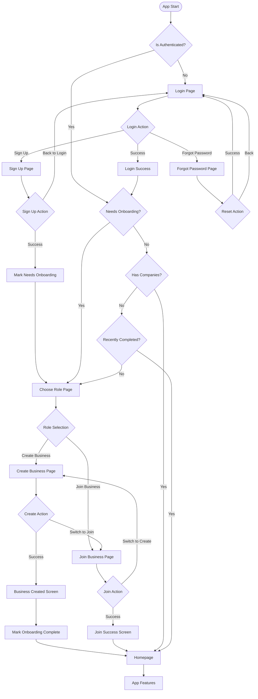

# Complete Authentication Navigation Flow Design

## 📊 Navigation Flow Diagram



## 🔍 Current Navigation Issues

### 1. **Critical Issue: Post-Business Creation Navigation**
- **Problem**: After creating business, "Go to Dashboard" redirects to Choose Role instead of Homepage
- **Root Cause**: `hasCompanies` provider hasn't updated from database yet
- **Location**: Line 127-130 in `app_router.dart`

### 2. **Timing Issues**
- Async providers (`userHasCompaniesProvider`) don't update immediately after database changes
- Router checks happen before database sync completes

## 📋 Complete Navigation Conditions

### Router Redirect Logic (`app_router.dart`)

| Condition | Current Location | Result | Line |
|-----------|-----------------|---------|------|
| `!isAuth && !isAuthRoute` | Any non-auth page | → `/auth/login` | 113-116 |
| `isAuth && needsOnboarding && !isOnboardingRoute` | Any page except onboarding | → `/onboarding/choose-role` | 118-123 |
| `isAuth && !needsOnboarding && !hasCompanies && !onboardingRecentlyCompleted && !isOnboardingRoute && !isAuthRoute` | Any main page | → `/onboarding/choose-role` | 125-131 |
| `isAuth && location=='/auth/login' && !needsOnboarding && hasCompanies` | Login page | → `/` (Homepage) | 133-137 |

### State Providers

| Provider | Purpose | Type | Location |
|----------|---------|------|----------|
| `isAuthenticatedProvider` | Check if user is logged in | `bool` | `auth_provider.dart:185` |
| `simpleOnboardingProvider` | Track onboarding needed state | `bool` | `simple_onboarding_provider.dart:31` |
| `isNewUserProvider` | Check if user is new | `bool` | `simple_onboarding_provider.dart:57` |
| `userHasCompaniesProvider` | Check if user has companies | `Future<bool>` | `simple_onboarding_provider.dart:36` |
| `onboardingRecentlyCompletedProvider` | Grace period after completion | `bool` | `simple_onboarding_provider.dart:38` |

## 🗺️ Page-by-Page Navigation

### 1. **Login Page** (`login_page.dart`)
```dart
// Success login
context.go('/') // Line 671

// Forgot password
context.go('/auth/forgot-password') // Line 481
```

### 2. **Sign Up Page** (`auth_signup_page.dart`)
```dart
// After successful signup
ref.read(simpleOnboardingProvider.notifier).markNeedsOnboarding() // Line 803
context.go('/onboarding/choose-role') // Line 815

// Back to login
context.pop() or context.go('/auth/login') // Line 695-697
```

### 3. **Choose Role Page** (`choose_role_page.dart`)
```dart
// Navigate to business pages
context.push('/onboarding/create-business') // Via _navigateToPage()
context.push('/onboarding/join-business') // Via _navigateToPage()
```

### 4. **Create Business Page** (`create_business_page.dart`)
```dart
// After business creation
ref.read(simpleOnboardingProvider.notifier).markOnboardingComplete() // Line 335
context.go('/') // Line 348

// Switch to join
context.pushReplacement('/onboarding/join-business') // Line 657
```

### 5. **Join Business Page** (`join_business_page.dart`)
```dart
// After joining
context.go('/') // Line 289

// Switch to create
context.pushReplacement('/onboarding/create-business') // Line 336
```

### 6. **Forgot Password Page** (`forgot_password_page.dart`)
```dart
// Back button
context.pop() // Line 42

// Back to sign in
context.go('/auth/login') // Line 184
```

## 🔴 Critical Navigation Flow Issues

### Issue #1: Business Creation → Homepage Navigation Fails
**Current Flow:**
1. User creates business
2. Clicks "Go to Dashboard"
3. `markOnboardingComplete()` called
4. `context.go('/')` executed
5. Router redirect checks:
   - `needsOnboarding = false` ✓
   - `hasCompanies = false` ✗ (async not updated)
   - `onboardingRecentlyCompleted = true` ✓ (5-second grace)
6. **Problem**: If grace period expires or doesn't work, redirects to Choose Role

### Issue #2: Async Provider Lag
- `userHasCompaniesProvider` queries database asynchronously
- Takes 100-500ms to update after business creation
- Router checks happen immediately on navigation

### Issue #3: Multiple Truth Sources
- `simpleOnboardingProvider` (immediate state)
- `userHasCompaniesProvider` (database state)
- `isNewUserProvider` (derived state)
- These can be out of sync temporarily

## ✅ Recommended Fixes

### Fix 1: Extend Grace Period
```dart
// In simple_onboarding_provider.dart
bool wasRecentlyCompleted() {
  if (_onboardingCompletedAt == null) return false;
  final difference = DateTime.now().difference(_onboardingCompletedAt!);
  return difference.inSeconds < 10; // Increase from 5 to 10 seconds
}
```

### Fix 2: Force Provider Refresh Before Navigation
```dart
// In create_business_page.dart
onPressed: () async {
  ref.read(simpleOnboardingProvider.notifier).markOnboardingComplete();
  
  // Force refresh and wait
  ref.invalidate(userHasCompaniesProvider);
  await ref.read(userHasCompaniesProvider.future); // Wait for update
  
  if (mounted) {
    context.go('/');
  }
}
```

### Fix 3: Add Business Creation Flag
```dart
// Add to SimpleOnboardingNotifier
bool _businessJustCreated = false;

void markBusinessCreated() {
  _businessJustCreated = true;
  markOnboardingComplete();
}

bool wasBusinessJustCreated() {
  return _businessJustCreated;
}
```

### Fix 4: Simplify Router Logic
```dart
// In app_router.dart redirect
// Priority 1: Not authenticated
if (!isAuth && !isAuthRoute) {
  return '/auth/login';
}

// Priority 2: Needs onboarding (explicit flag)
if (isAuth && needsOnboarding && !isOnboardingRoute) {
  return '/onboarding/choose-role';
}

// Priority 3: Skip company check for recent completions
if (isAuth && onboardingRecentlyCompleted) {
  // Allow navigation, don't redirect
  return null;
}

// Priority 4: No companies (only after grace period)
if (isAuth && !hasCompanies && hasCompaniesAsync.hasValue && 
    !isOnboardingRoute && !isAuthRoute) {
  return '/onboarding/choose-role';
}
```

## 📊 Navigation State Machine

| State | isAuth | needsOnboarding | hasCompanies | recentlyCompleted | Target |
|-------|--------|-----------------|--------------|-------------------|---------|
| Not Logged In | false | - | - | - | `/auth/login` |
| Just Signed Up | true | true | false | false | `/onboarding/choose-role` |
| Choosing Role | true | true | false | false | Stay on current |
| Just Created Business | true | false | false | true | `/` (Homepage) |
| After Grace Period | true | false | false | false | `/onboarding/choose-role` |
| Established User | true | false | true | false | `/` (Homepage) |

## 🎯 Testing Scenarios

1. **New User Signup Flow**
   - Sign up → Should go to Choose Role
   - Choose "Create Business" → Should show form
   - Create business → Should go to Homepage

2. **Join Business Flow**
   - Sign up → Choose Role
   - Choose "Join Business" → Enter code
   - Join → Should go to Homepage

3. **Existing User Login**
   - Login with account that has business → Homepage
   - Login with account without business → Choose Role

4. **Edge Cases**
   - Refresh page during onboarding
   - Navigate directly to protected routes
   - Session timeout during onboarding

## 📝 Summary

The navigation flow has multiple decision points based on:
1. Authentication status
2. Onboarding completion state
3. Company association
4. Grace period after business creation

The main issue is the timing mismatch between immediate state updates and async database queries, causing incorrect redirects after business creation.