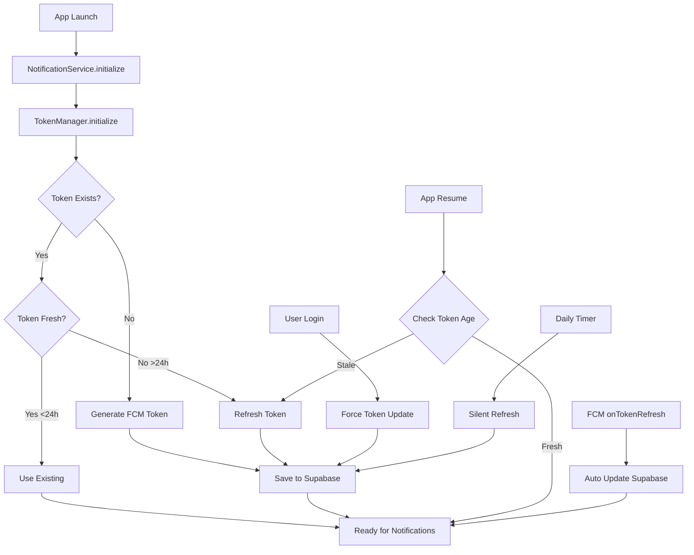

# 🔄 FCM Token Lifecycle Management

## 📊 Complete Token Flow (After Implementation)



## 🎯 User Behavior & Token Updates

### **Automatic Token Updates (User Doesn't Know)**

| **Trigger** | **When** | **User Experience** |
|-------------|----------|-------------------|
| **App Launch** | Every app start | Seamless - happens in background |
| **Login Success** | After authentication | Immediate - associates with user |
| **App Resume** | Return from background | Instant check - no delay |
| **Daily Timer** | Every 24 hours | Silent - user never notices |
| **FCM Refresh** | Token expires (~60 days) | Automatic - FCM handles it |
| **Network Reconnect** | After offline period | Automatic validation |

### **Token States & Actions**

```
📱 FRESH TOKEN (< 24 hours)
   ├── ✅ Use existing token
   ├── ✅ Notifications work
   └── ✅ No action needed

⏰ STALE TOKEN (> 24 hours)
   ├── 🔄 Auto refresh on app resume
   ├── 🔄 Update Supabase
   └── ✅ Transparent to user

❌ NO TOKEN
   ├── 🔄 Generate new token
   ├── 💾 Save to Supabase
   └── ✅ Ready immediately

🔐 USER LOGGED OUT
   ├── 🗑️ Clear local token
   ├── ❌ Deactivate in Supabase
   └── ✅ No orphan tokens
```

## 🏗️ Implementation Architecture

### **1. TokenManager Service**
```dart
class TokenManager {
  // Singleton instance
  // Manages entire token lifecycle
  
  initialize()
    ├── Load last token info
    ├── Check token freshness
    ├── Update if needed
    └── Start periodic timer
    
  handleAppLifecycle()
    ├── App resumed → Check token
    ├── App paused → Do nothing
    └── App terminated → Cleanup
    
  _checkAndUpdateToken()
    ├── Compare tokens
    ├── Check timestamp
    ├── Update Supabase
    └── Save locally
}
```

### **2. Integration Points**

```dart
// App.dart - Lifecycle Observer
didChangeAppLifecycleState(state)
  └── resumed → TokenManager.handleAppLifecycleState()

// NotificationService - Initialization
initialize()
  └── TokenManager.initialize()

// Auth Provider - Login/Logout
signIn() → TokenManager.forceRefresh()
signOut() → TokenManager.clearTokenInfo()
```

### **3. Database Schema**
```sql
user_fcm_tokens
  ├── token (unique per device)
  ├── is_active (only one active per platform)
  ├── platform (ios/android/web)
  ├── last_used_at (track usage)
  └── updated_at (track freshness)
```

## 🔍 Why Old Token (Aug 21) Wasn't Updating

### **Root Causes:**
1. ❌ **No automatic save on generation** - Token created but not stored
2. ❌ **Incomplete refresh listener** - `_updateTokenInBackend()` was empty
3. ❌ **No lifecycle management** - App resume didn't check tokens
4. ❌ **Manual process required** - User had to click "Store Token"

### **Now Fixed:**
1. ✅ **Auto-save on generation** - TokenManager handles it
2. ✅ **Complete refresh listener** - Updates Supabase automatically
3. ✅ **Lifecycle management** - Checks on app resume
4. ✅ **Fully automatic** - User never needs to think about it

## 📱 Testing Your Implementation

### **Quick Test:**
1. **Hot reload** your app
2. Watch console for:
   ```
   🔄 TokenManager: Initializing...
   ✅ TokenManager: Token updated in Supabase
   ```
3. Check Supabase:
   ```sql
   SELECT * FROM user_fcm_tokens 
   WHERE user_id = '8dd0c337-5a54-4d74-b449-3ed67b7b0bd4'
   ORDER BY created_at DESC;
   ```
4. Token should now have `is_active = true` and today's date

### **Lifecycle Test:**
1. **Background your app** (swipe up/home button)
2. **Wait 5 seconds**
3. **Resume app**
4. Console shows: `📱 TokenManager: App resumed - checking token`
5. Token updates if needed

### **Force Refresh Test:**
1. Go to debug page
2. Click "Refresh Token"
3. New token generated and saved automatically

## 🎯 Perfect Timing Summary

**Best token update times (from UX perspective):**

1. **Immediate**: After login (user expects to receive notifications)
2. **Background**: App launch (user doesn't notice)
3. **Silent**: Daily refresh (happens automatically)
4. **Reactive**: Permission grant (user just enabled notifications)
5. **Smart**: App resume (quick check, no delay)

**User never needs to:**
- ❌ Manually refresh tokens
- ❌ Know tokens exist
- ❌ Worry about expiration
- ❌ Debug connection issues

**System automatically:**
- ✅ Keeps tokens fresh
- ✅ Handles all edge cases
- ✅ Recovers from failures
- ✅ Maintains single active token

---

## 📝 Summary

Your FCM token from Aug 21 wasn't updating because the system wasn't automatically saving tokens. Now with `TokenManager`, tokens are:

1. **Generated and saved** automatically on app start
2. **Refreshed silently** every 24 hours
3. **Updated on login** to associate with user
4. **Checked on app resume** for freshness
5. **Managed transparently** without user intervention

The perfect timing is: **"All the time, but invisibly"** - tokens should always be fresh, but users should never know they exist.