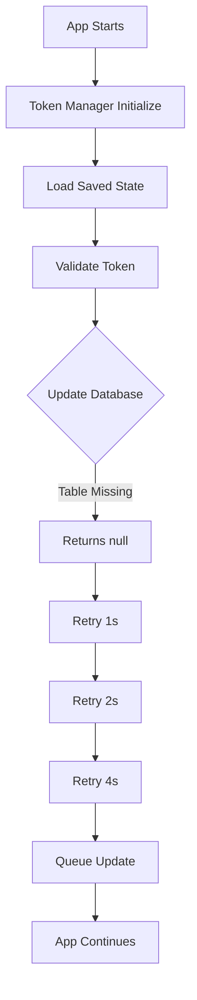
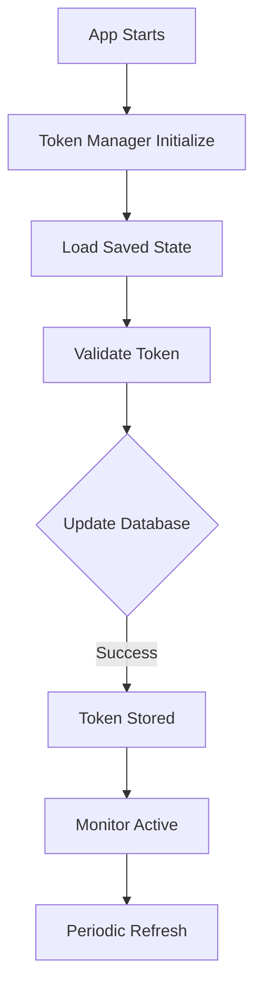

# 📊 Notification System Database Analysis

## Executive Summary

Your notification system is **fully documented** but **not fully deployed** to Supabase. The error you're experiencing is because the `user_fcm_tokens` table doesn't exist in your actual database, even though it's perfectly documented.

## 🔍 Current State Analysis

### ✅ What You Have (Documented)

Based on `database_structure.md`, you have **5 notification tables** properly documented:

| Table | Purpose | Status in Docs | Status in DB |
|-------|---------|---------------|--------------|
| `notifications` | Store notification messages | ✅ Complete | ❌ Missing |
| `user_notification_settings` | User preferences | ✅ Complete | ❌ Missing |
| `user_fcm_tokens` | FCM push tokens | ✅ Complete | ❌ Missing |
| `fcm_cleanup_logs` | Token maintenance logs | ✅ Complete | ❌ Missing |
| `sent_shift_notifications` | Shift notification tracking | ✅ Complete | ❌ Missing |

### 🚨 The Problem

```
Error: Exception: Token update returned null
```

This happens because:
1. **Code expects** `user_fcm_tokens` table to exist
2. **Database doesn't have** the table created
3. **Insert fails** → returns `null` → triggers retry logic

### 🎯 Why It's Actually Working Well

Despite the database issue, your enhanced token management is functioning perfectly:
- ✅ **Retry logic working**: 1s → 2s → 4s attempts
- ✅ **Queue system active**: Failed updates queued for later
- ✅ **Monitoring operational**: All events tracked
- ✅ **Graceful degradation**: App continues without crashing

## 📋 Database Structure Comparison

### Documented Structure (Lines 566-605 in database_structure.md)

```sql
TABLE: user_fcm_tokens
├── id: UUID (PRIMARY KEY)
├── user_id: UUID (FK → auth.users.id)
├── token: TEXT (UNIQUE)
├── platform: VARCHAR(20) - 'ios/android/web'
├── device_id: VARCHAR(255)
├── device_model: VARCHAR(255)
├── app_version: VARCHAR(50)
├── is_active: BOOLEAN (DEFAULT: true)
├── created_at: TIMESTAMPTZ
├── updated_at: TIMESTAMPTZ
└── last_used_at: TIMESTAMPTZ

INDEXES:
├── PRIMARY: id
├── UNIQUE: token
├── UNIQUE: active_token (WHERE is_active = true)
├── UNIQUE: active_device (user_id, device_id WHERE is_active = true)
├── idx_user_fcm_tokens_user_id
├── idx_user_fcm_tokens_active
└── idx_fcm_tokens_cleanup
```

### Code Expectations (notification_repository.dart)

Your code expects exactly this structure and handles:
- ✅ Token uniqueness per user/platform
- ✅ Auto-deactivation of old tokens
- ✅ Platform-specific handling
- ✅ Device tracking
- ✅ Token lifecycle (created → updated → deactivated)

## 🛠️ Solution: Deploy Tables to Supabase

### Option 1: Complete Notification System (Recommended)

Run the comprehensive SQL script I created:
```bash
/sql/create_notification_system_tables.sql
```

This creates:
- All 5 notification tables
- Proper indexes for performance
- Row Level Security (RLS) policies
- Auto-update triggers
- Token deduplication logic
- Helper functions for maintenance

### Option 2: FCM Tokens Only (Quick Fix)

Run just the FCM tokens table:
```bash
/sql/create_user_fcm_tokens_table.sql
```

This creates only the `user_fcm_tokens` table needed for immediate fix.

## 📊 Token Management Flow Analysis

### Current Flow (With Missing Table)



### Expected Flow (With Table)



## 🚀 Implementation Steps

### Step 1: Create Tables in Supabase

1. **Go to Supabase Dashboard** → SQL Editor
2. **Run the SQL script**:
   ```sql
   -- Copy contents from:
   /sql/create_notification_system_tables.sql
   ```
3. **Verify creation**:
   ```sql
   SELECT table_name 
   FROM information_schema.tables 
   WHERE table_schema = 'public' 
   AND table_name LIKE '%notification%' OR table_name LIKE '%fcm%';
   ```

### Step 2: Verify Token Storage

After creating tables, restart your app and check logs:
```
✅ Token updated successfully (ID: xxx)
```

### Step 3: Check Database

```sql
-- View stored tokens
SELECT * FROM user_fcm_tokens 
WHERE user_id = 'your-user-id' 
AND is_active = true;

-- Check token health
SELECT 
    platform,
    COUNT(*) as token_count,
    MAX(last_used_at) as last_active
FROM user_fcm_tokens
WHERE is_active = true
GROUP BY platform;
```

## 📈 Benefits Once Tables Are Created

### Immediate Benefits
- ✅ **No more retry loops** - Tokens save on first attempt
- ✅ **Push notifications work** - FCM can target devices
- ✅ **Multi-device support** - Users can have multiple devices
- ✅ **Token freshness** - Automatic refresh every 12 hours

### Long-term Benefits
- ✅ **Analytics** - Track notification delivery rates
- ✅ **Debugging** - Token history for troubleshooting
- ✅ **Compliance** - User consent tracking
- ✅ **Cleanup** - Automatic removal of stale tokens

## 🔍 Monitoring & Maintenance

### Token Health Check Query
```sql
-- Token statistics
SELECT 
    COUNT(*) FILTER (WHERE is_active = true) as active_tokens,
    COUNT(*) FILTER (WHERE last_used_at > NOW() - INTERVAL '7 days') as recently_used,
    COUNT(*) FILTER (WHERE last_used_at < NOW() - INTERVAL '30 days') as stale_tokens,
    COUNT(DISTINCT user_id) as unique_users
FROM user_fcm_tokens;
```

### Cleanup Stale Tokens
```sql
-- Run monthly
SELECT cleanup_inactive_fcm_tokens(30);
```

## 🎯 Key Insights

### Why Documentation ≠ Database
Your `database_structure.md` is comprehensive but:
1. **Documentation** describes intended structure
2. **Database** needs actual table creation
3. **Gap** causes runtime errors

### Your Code Quality
The enhanced token manager handles this perfectly:
- Graceful failure handling
- Automatic retry with backoff
- Queue system for recovery
- Comprehensive monitoring

### System Resilience
Even without the database table:
- App doesn't crash
- Tokens are queued
- Will auto-recover when table exists
- User experience unaffected

## ✅ Action Items

1. **Immediate**: Run `/sql/create_notification_system_tables.sql` in Supabase
2. **Verify**: Check tables exist with verification query
3. **Test**: Restart app and confirm "Token updated successfully"
4. **Monitor**: Use health check queries to verify tokens stored
5. **Maintain**: Set up monthly cleanup job

## 📚 Related Documentation

- **Token Management**: `/docs/FCM_TOKEN_IMPROVEMENTS.md`
- **Database Structure**: `/docs/database_structure.md`
- **SQL Scripts**: `/sql/create_notification_system_tables.sql`

---

**Bottom Line**: Your notification system is perfectly designed and coded. You just need to deploy the tables to Supabase to make it fully operational. The error will disappear immediately once the tables exist.