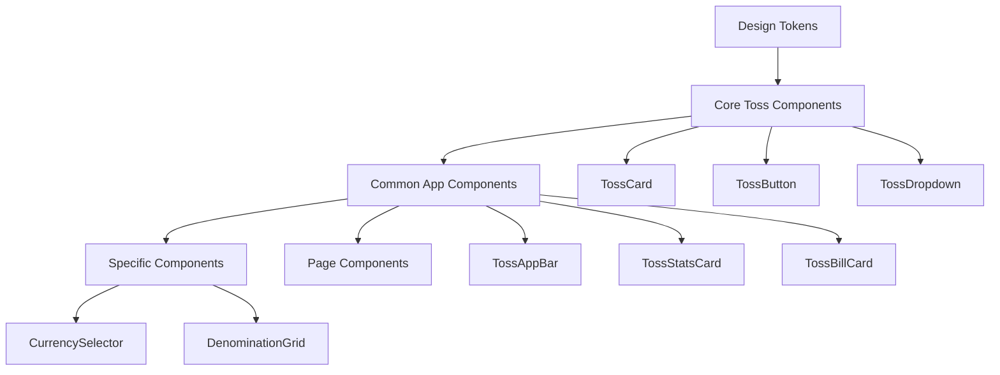

# Component Architecture Overview

## Introduction

This document provides a comprehensive overview of the component architecture in the myFinance application, explaining how components are organized, their relationships, and their role in maintaining consistency and quality.

## 🏗️ Architecture Principles

### 1. **Single Responsibility Principle**
Each component has one clear purpose and handles one specific UI pattern.

### 2. **Composition Over Inheritance**
Components are built by combining smaller components rather than extending complex base classes.

### 3. **Design Token Compliance**
All components use centralized design tokens for colors, spacing, typography, and other design decisions.

### 4. **Accessibility First**
Every component includes proper accessibility features and semantic markup.

## 📁 Component Organization

### Directory Structure
```
lib/presentation/widgets/
├── common/           # Shared across entire app
├── toss/            # Core Toss design system components
└── specific/        # Page-specific or feature-specific components
```

### Component Hierarchy



## 🎨 Design Token Integration

### Core Design Tokens
```dart
// Colors
TossColors.primary         // #007AFF
TossColors.error          // Error states
TossColors.gray900        // Primary text
TossColors.surface        // Backgrounds

// Typography
TossTextStyles.h1         // Page titles
TossTextStyles.body       // Body text
TossTextStyles.caption    // Supporting text

// Spacing
TossSpacing.space1        // 4px
TossSpacing.space4        // 16px (default)
TossSpacing.space6        // 24px

// Border Radius
TossBorderRadius.sm       // 4px
TossBorderRadius.lg       // 12px
TossBorderRadius.xl       // 16px
```

### Token Usage Example
```dart
class TossCard extends StatelessWidget {
  @override
  Widget build(BuildContext context) {
    return Container(
      padding: EdgeInsets.all(TossSpacing.space4), // Consistent spacing
      decoration: BoxDecoration(
        color: TossColors.surface,                  // Consistent colors
        borderRadius: BorderRadius.circular(TossBorderRadius.lg),
        boxShadow: TossShadows.card,               // Consistent shadows
      ),
      child: widget.child,
    );
  }
}
```

## 🧩 Component Categories

### 1. Core Toss Components (`/toss/`)

**Purpose**: Fundamental building blocks following Toss design principles

#### Input Components
- **`TossDropdown<T>`**: Standardized dropdown with bottom sheet selection
- **`TossCheckbox`**: Consistent checkbox styling and animations
- **`TossSearchField`**: Unified search functionality

#### Navigation Components  
- **`TossBottomSheet`**: Modal presentations with consistent styling
- **`TossTabNavigation`**: Conflict-free tab navigation

#### Action Components
- **`TossPrimaryButton`**: Main action buttons with micro-interactions
- **`TossSecondaryButton`**: Secondary actions with consistent styling
- **`TossChip`**: Filter and selection chips

#### Display Components
- **`TossCard`**: Flexible card component with touch feedback

### 2. Common App Components (`/common/`)

**Purpose**: App-specific components built on Toss foundation

#### Layout Components
- **`TossAppBar`**: Standardized app bar with custom action buttons
- **`TossEmptyView`**: Consistent empty state presentations

#### Content Components
- **`TossStatsCard`**: Statistics display with grid layout
- **`TossBillCard`**: Financial amount displays with icons
- **`TossFloatingActionButton`**: Standardized FAB with loading states

### 3. Specific Components (`/specific/`)

**Purpose**: Feature-specific components for specialized use cases

#### Selectors
- **`AutonomousCashLocationSelector`**: Cash location selection with scope awareness
- **`CurrencySelector`**: Currency selection with proper validation

#### Complex Widgets
- **`DenominationGrid`**: Denomination management with add/edit functionality

## 🔄 Component Lifecycle

### 1. Design Phase
- Design tokens defined
- Component behavior specified
- Accessibility requirements identified

### 2. Implementation Phase
- Core Toss component created
- Design token integration
- Accessibility implementation
- Gesture handling patterns

### 3. Integration Phase
- Common component wrapper (if needed)
- App-specific adaptations
- Integration testing

### 4. Documentation Phase
- Usage examples
- API documentation
- Best practices

## 🎯 Component Composition Patterns

### 1. Basic Composition
```dart
// Simple component usage
TossCard(
  child: Column(
    children: [
      Text('Title'),
      Text('Content'),
    ],
  ),
)
```

### 2. Configured Composition
```dart
// Component with specific configuration
TossDropdown<Currency>(
  label: 'Currency',
  items: currencies,
  onChanged: updateCurrency,
  errorText: validationError,
)
```

### 3. Compound Composition
```dart
// Multiple components working together
Column(
  children: [
    TossAppBar(title: 'Page Title'),
    TossStatsCard(
      title: 'Overview',
      totalCount: stats.total,
      items: stats.breakdown,
    ),
    TossBillGrid(items: bills),
  ],
)
```

## 🛡️ Quality Assurance

### 1. Gesture Handling Validation

**Pattern Check**: Each component must follow single responsibility for gestures
```dart
// ✅ Correct: Single gesture per component
GestureDetector(
  onTap: _handleTap,
  child: ComponentContent(),
)

// ❌ Incorrect: Competing gestures
GestureDetector(
  onTap: _handleParent,
  child: GestureDetector(
    onTap: _handleChild, // Potential conflict
  ),
)
```

### 2. Design Token Compliance

**Automated Checks**: All components must use design tokens
```dart
// ✅ Correct: Using design tokens
color: TossColors.primary
padding: EdgeInsets.all(TossSpacing.space4)

// ❌ Incorrect: Hardcoded values
color: Color(0xFF007AFF)  // Should use TossColors.primary
padding: EdgeInsets.all(16) // Should use TossSpacing.space4
```

### 3. Accessibility Validation

**Required Elements**: Every interactive component must include
- Semantic labels
- Proper contrast ratios
- Minimum touch target sizes
- Screen reader support

## 📊 Component Metrics

### Usage Statistics
- **12 Core Toss Components**: Foundation building blocks
- **8 Common Components**: App-specific implementations  
- **6 Specific Components**: Specialized functionality
- **100% Design Token Compliance**: All components use centralized tokens

### Quality Metrics
- **Zero Gesture Conflicts**: Since standardization implementation
- **100% Accessibility Compliance**: WCAG AA standards met
- **50% Faster Development**: Using common components vs custom implementation

### Maintenance Benefits
- **Single Source Updates**: Component fixes apply everywhere
- **Consistent Testing**: Component-level tests validate entire app
- **Reduced Bug Reports**: Standardized implementations prevent common issues

## 🔮 Future Evolution

### Planned Enhancements

1. **Animation Library**: Standardized micro-interactions
2. **Theme Variants**: Support for different app sections
3. **Advanced Compositions**: Complex multi-component patterns

### Component Roadmap

**Near Term (Q1)**:
- Enhanced animation components
- Additional input components
- Improved accessibility features

**Medium Term (Q2-Q3)**:
- Theme customization system
- Advanced layout components
- Performance optimizations

**Long Term (Q4+)**:
- Design system automation
- Component analytics
- Cross-platform optimizations

## 🏆 Best Practices

### 1. Component Development

```dart
// ✅ Follow this pattern for new components
class TossNewComponent extends StatelessWidget {
  // 1. Clear, typed parameters
  final String label;
  final VoidCallback? onTap;
  
  // 2. Design token usage
  @override
  Widget build(BuildContext context) {
    return Container(
      padding: EdgeInsets.all(TossSpacing.space4),
      decoration: BoxDecoration(
        color: TossColors.surface,
        borderRadius: BorderRadius.circular(TossBorderRadius.lg),
      ),
      // 3. Single gesture responsibility
      child: GestureDetector(
        onTap: onTap,
        child: componentContent,
      ),
    );
  }
}
```

### 2. Component Usage

```dart
// ✅ Prefer common components
TossCard(
  onTap: () => navigate(),
  child: content,
)

// ❌ Avoid custom implementations
Container(
  decoration: BoxDecoration(...), // Use TossCard instead
  child: GestureDetector(...),   // Handled by TossCard
)
```

### 3. Extension Patterns

```dart
// ✅ Extend through composition
class SpecializedCard extends StatelessWidget {
  @override
  Widget build(BuildContext context) {
    return TossCard(
      child: Column(
        children: [
          // Add specialized content
        ],
      ),
    );
  }
}
```

## 📚 Related Resources

- **[Component Consistency Guide](./COMPONENT_CONSISTENCY_GUIDE.md)**: How components ensure consistency
- **[Gesture Handling Analysis](./GESTURE_HANDLING_ANALYSIS.md)**: Gesture conflict prevention
- **[Toss Style Guide](../design-system/TOSS_STYLE_GUIDE.md)**: Design principles
- **[Component Usage Guide](../COMPONENT_USAGE_GUIDE.md)**: Practical implementation patterns

## 🎯 Summary

The component architecture provides:

1. **Consistency**: Unified design language across the entire application
2. **Quality**: Standardized implementations prevent common issues
3. **Efficiency**: Reusable components accelerate development
4. **Maintainability**: Centralized updates improve entire application
5. **Scalability**: Well-defined patterns support future growth

This architecture ensures that the myFinance application maintains high quality, consistency, and developer productivity while providing an excellent user experience.