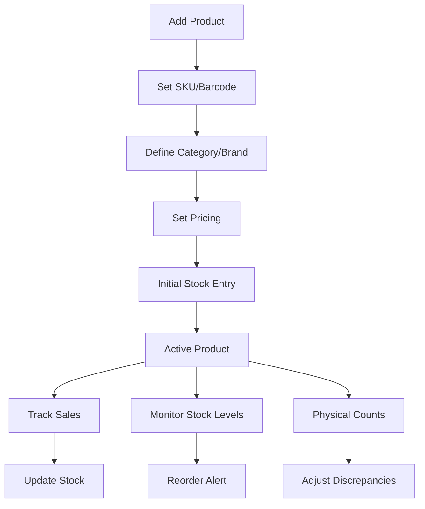
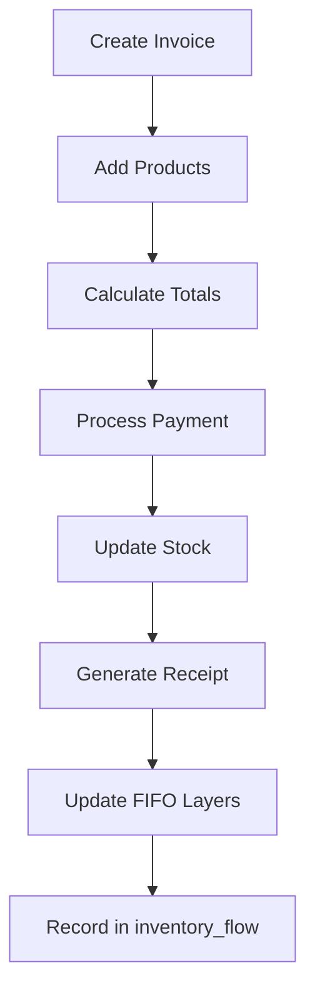
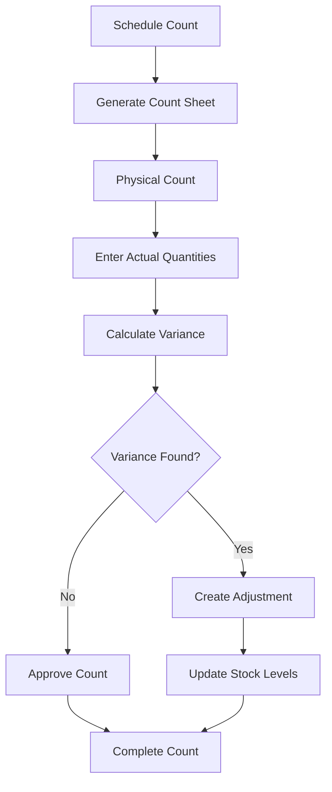

# Inventory Management System Implementation Guide

## System Overview

The inventory management system is designed for retail businesses, particularly luxury goods stores, providing comprehensive stock control, sales tracking, and inventory counting capabilities.

## Core Workflows

### 1. Product Lifecycle Management



### 2. Sales Transaction Flow



### 3. Inventory Count Process



## Database Integration

### Key Tables and Their Roles

1. **inventory_products**: Master product data
2. **inventory_current_stock**: Real-time stock levels by location
3. **inventory_sales**: Sales transactions
4. **inventory_sale_items**: Sales line items
5. **inventory_counts**: Physical count sessions
6. **inventory_count_items**: Count details
7. **inventory_flow**: Complete audit trail

## Implementation Steps

### Phase 1: Core Product Management
```dart
// 1. Create Product Service
class ProductService {
  final SupabaseClient supabase;
  
  Future<Product> createProduct({
    required String sku,
    required String name,
    required String categoryId,
    required String brandId,
    required double costPrice,
    required double salePrice,
    String? barcode,
    String? position,
    int minStock = 0,
    int maxStock = 100,
  }) async {
    final response = await supabase
      .from('inventory_products')
      .insert({
        'company_id': currentCompanyId,
        'sku': sku,
        'barcode': barcode,
        'product_name': name,
        'category_id': categoryId,
        'brand_id': brandId,
        'cost_price': costPrice,
        'selling_price': salePrice,
        'min_stock': minStock,
        'max_stock': maxStock,
        'position': position,
      })
      .select()
      .single();
    
    // Initialize stock record
    await _initializeStock(response['product_id']);
    
    return Product.fromJson(response);
  }
  
  Future<void> _initializeStock(String productId) async {
    await supabase.from('inventory_current_stock').insert({
      'company_id': currentCompanyId,
      'store_id': currentStoreId,
      'product_id': productId,
      'quantity_on_hand': 0,
      'quantity_available': 0,
      'average_cost': 0,
    });
  }
}
```

### Phase 2: Sales/Invoice Processing
```dart
// 2. Create Sales Service
class SalesService {
  final SupabaseClient supabase;
  
  Future<Sale> createSale({
    required List<SaleItem> items,
    String? customerId,
    required String paymentMethod,
  }) async {
    // Start transaction
    final saleData = {
      'company_id': currentCompanyId,
      'store_id': currentStoreId,
      'invoice_number': generateInvoiceNumber(),
      'customer_id': customerId,
      'sale_date': DateTime.now().toIso8601String(),
      'payment_method': paymentMethod,
      'subtotal': calculateSubtotal(items),
      'tax_amount': calculateTax(items),
      'total_amount': calculateTotal(items),
      'status': 'completed',
    };
    
    final sale = await supabase
      .from('inventory_sales')
      .insert(saleData)
      .select()
      .single();
    
    // Add line items and update stock
    for (final item in items) {
      await _processSaleItem(sale['sale_id'], item);
    }
    
    return Sale.fromJson(sale);
  }
  
  Future<void> _processSaleItem(String saleId, SaleItem item) async {
    // Insert sale item
    await supabase.from('inventory_sale_items').insert({
      'sale_id': saleId,
      'product_id': item.productId,
      'quantity': item.quantity,
      'unit_price': item.unitPrice,
      'line_total': item.lineTotal,
    });
    
    // Update stock
    await _updateStock(item.productId, -item.quantity);
    
    // Record flow
    await _recordFlow(
      productId: item.productId,
      flowType: 'sale',
      quantity: -item.quantity,
      referenceId: saleId,
    );
  }
}
```

### Phase 3: Inventory Counting
```dart
// 3. Create Inventory Count Service
class InventoryCountService {
  final SupabaseClient supabase;
  
  Future<InventoryCount> createCount({
    required CountType type,
    List<String>? productIds,
  }) async {
    final count = await supabase
      .from('inventory_counts')
      .insert({
        'company_id': currentCompanyId,
        'store_id': currentStoreId,
        'count_number': generateCountNumber(),
        'count_date': DateTime.now().toIso8601String(),
        'count_type': type.name,
        'status': 'in_progress',
      })
      .select()
      .single();
    
    // Pre-populate count items
    final products = productIds ?? await _getAllActiveProducts();
    for (final productId in products) {
      final currentStock = await _getCurrentStock(productId);
      await supabase.from('inventory_count_items').insert({
        'count_id': count['count_id'],
        'product_id': productId,
        'system_quantity': currentStock,
      });
    }
    
    return InventoryCount.fromJson(count);
  }
  
  Future<void> submitCount(String countId, Map<String, double> actualQuantities) async {
    // Update actual quantities
    for (final entry in actualQuantities.entries) {
      await supabase
        .from('inventory_count_items')
        .update({'actual_quantity': entry.value})
        .eq('count_id', countId)
        .eq('product_id', entry.key);
    }
    
    // Process adjustments
    await _processAdjustments(countId);
    
    // Complete count
    await supabase
      .from('inventory_counts')
      .update({'status': 'completed'})
      .eq('count_id', countId);
  }
}
```

## UI Implementation

### 1. Invoice Page (Based on Screenshot 1)
```dart
class InvoicePage extends StatelessWidget {
  @override
  Widget build(BuildContext context) {
    return Scaffold(
      appBar: AppBar(
        title: Text('Invoice'),
        actions: [
          IconButton(icon: Icon(Icons.search), onPressed: () {}),
          IconButton(icon: Icon(Icons.sort), onPressed: () {}),
          IconButton(icon: Icon(Icons.more_vert), onPressed: () {}),
        ],
      ),
      body: Column(
        children: [
          // Date selector
          DateSelector(
            selectedDate: DateTime.now(),
            onDateChanged: (date) {},
          ),
          // Invoice summary
          InvoiceSummary(
            invoiceCount: 2,
            subtotal: 7100000,
          ),
          // Invoice list
          Expanded(
            child: ListView(
              children: [
                InvoiceTile(
                  invoiceNumber: 'HD011114',
                  amount: 6500000,
                  customer: 'Guest',
                  items: ['프라다가방 - Prada Bag x1'],
                  status: 'Completed',
                  timestamp: '31/08/2025 14:29',
                ),
                InvoiceTile(
                  invoiceNumber: 'HD011113',
                  amount: 600000,
                  customer: 'Guest',
                  items: ['rattan Bag(라탄백) x2'],
                  status: 'Completed',
                  timestamp: '31/08/2025 10:34',
                ),
              ],
            ),
          ),
        ],
      ),
    );
  }
}
```

### 2. Add Product Page (Based on Screenshot 2)
```dart
class AddProductPage extends StatefulWidget {
  @override
  _AddProductPageState createState() => _AddProductPageState();
}

class _AddProductPageState extends State<AddProductPage> {
  final _formKey = GlobalKey<FormState>();
  File? _productImage;
  final _barcodeController = TextEditingController();
  final _nameController = TextEditingController();
  final _salePriceController = TextEditingController();
  final _costPriceController = TextEditingController();
  final _onHandController = TextEditingController();
  final _weightController = TextEditingController();
  
  String? _selectedCategory;
  String? _selectedBrand;
  String? _selectedPosition;
  bool _sellInStore = true;
  
  @override
  Widget build(BuildContext context) {
    return Scaffold(
      appBar: AppBar(
        title: Text('Add product'),
        actions: [
          TextButton(
            child: Text('Save'),
            onPressed: _saveProduct,
          ),
        ],
      ),
      body: Form(
        key: _formKey,
        child: ListView(
          padding: EdgeInsets.all(16),
          children: [
            // Image picker
            ImagePickerCard(
              image: _productImage,
              onImagePicked: (file) => setState(() => _productImage = file),
            ),
            
            // Product number (auto-generated)
            TextFormField(
              decoration: InputDecoration(
                labelText: 'Product number',
                hintText: 'Generated automatically',
                enabled: false,
                suffixIcon: Icon(Icons.qr_code),
              ),
            ),
            
            // Barcode
            TextFormField(
              controller: _barcodeController,
              decoration: InputDecoration(
                labelText: 'Barcode',
                suffixIcon: IconButton(
                  icon: Icon(Icons.qr_code_scanner),
                  onPressed: _scanBarcode,
                ),
              ),
            ),
            
            // Product name
            TextFormField(
              controller: _nameController,
              decoration: InputDecoration(
                labelText: 'Product name',
                hintText: 'Product name',
              ),
              validator: (value) => value?.isEmpty ?? true ? 'Required' : null,
            ),
            
            // Category dropdown
            DropdownButtonFormField<String>(
              value: _selectedCategory,
              decoration: InputDecoration(
                labelText: 'Product category',
                hintText: 'Select product category',
              ),
              items: categories.map((c) => DropdownMenuItem(
                value: c.id,
                child: Text(c.name),
              )).toList(),
              onChanged: (value) => setState(() => _selectedCategory = value),
            ),
            
            // Brand dropdown
            DropdownButtonFormField<String>(
              value: _selectedBrand,
              decoration: InputDecoration(
                labelText: 'Brand',
                hintText: 'Choose brand',
              ),
              items: brands.map((b) => DropdownMenuItem(
                value: b.id,
                child: Text(b.name),
              )).toList(),
              onChanged: (value) => setState(() => _selectedBrand = value),
            ),
            
            // Sale price
            TextFormField(
              controller: _salePriceController,
              decoration: InputDecoration(
                labelText: 'Sale price',
                prefixText: '₩',
              ),
              keyboardType: TextInputType.number,
              validator: (value) => value?.isEmpty ?? true ? 'Required' : null,
            ),
            
            // Cost of goods
            TextFormField(
              controller: _costPriceController,
              decoration: InputDecoration(
                labelText: 'Cost of goods',
                prefixText: '₩',
              ),
              keyboardType: TextInputType.number,
            ),
            
            // On-hand quantity
            TextFormField(
              controller: _onHandController,
              decoration: InputDecoration(
                labelText: 'On-hand',
                suffixIcon: Icon(Icons.info_outline),
              ),
              keyboardType: TextInputType.number,
            ),
            
            // Weight
            TextFormField(
              controller: _weightController,
              decoration: InputDecoration(
                labelText: 'Weight (g)',
              ),
              keyboardType: TextInputType.number,
            ),
            
            // Position dropdown
            DropdownButtonFormField<String>(
              value: _selectedPosition,
              decoration: InputDecoration(
                labelText: 'Position',
                hintText: 'Select location',
              ),
              items: locations.map((l) => DropdownMenuItem(
                value: l,
                child: Text(l),
              )).toList(),
              onChanged: (value) => setState(() => _selectedPosition = value),
            ),
            
            // Sell in-store toggle
            SwitchListTile(
              title: Text('Sell in-store'),
              value: _sellInStore,
              onChanged: (value) => setState(() => _sellInStore = value),
            ),
            
            // Add attribute button
            TextButton.icon(
              icon: Icon(Icons.add_circle_outline),
              label: Text('Add attribute'),
              onPressed: _addAttribute,
            ),
          ],
        ),
      ),
    );
  }
}
```

## Key Features to Implement

### 1. Barcode Scanning
```dart
import 'package:mobile_scanner/mobile_scanner.dart';

class BarcodeScanner extends StatelessWidget {
  final Function(String) onScan;
  
  @override
  Widget build(BuildContext context) {
    return MobileScanner(
      onDetect: (capture) {
        final List<Barcode> barcodes = capture.barcodes;
        for (final barcode in barcodes) {
          if (barcode.rawValue != null) {
            onScan(barcode.rawValue!);
            Navigator.pop(context);
            break;
          }
        }
      },
    );
  }
}
```

### 2. Real-time Stock Updates
```dart
class StockUpdateService {
  Stream<StockLevel> watchStockLevel(String productId) {
    return supabase
      .from('inventory_current_stock')
      .stream(primaryKey: ['stock_id'])
      .eq('product_id', productId)
      .map((data) => StockLevel.fromJson(data.first));
  }
  
  Future<void> updateStock(String productId, double quantityChange) async {
    await supabase.rpc('update_stock_level', params: {
      'p_product_id': productId,
      'p_quantity_change': quantityChange,
      'p_store_id': currentStoreId,
    });
  }
}
```

### 3. Low Stock Alerts
```dart
class StockAlertService {
  Stream<List<Product>> watchLowStockProducts() {
    return supabase
      .from('inventory_current_stock')
      .stream(primaryKey: ['stock_id'])
      .lte('quantity_available', 'reorder_point')
      .order('quantity_available');
  }
  
  Future<void> createReorderSuggestion(String productId) async {
    final product = await getProduct(productId);
    final suggestedQuantity = product.reorderQuantity ?? 
                             (product.maxStock - product.onHand);
    
    // Create purchase order suggestion
    await createPurchaseOrderDraft(
      productId: productId,
      quantity: suggestedQuantity,
      supplierId: product.preferredSupplierId,
    );
  }
}
```

## Security Considerations

1. **Role-Based Access Control**
   - Cashiers: Can create sales, view products
   - Managers: Can edit products, approve counts
   - Admins: Full access including pricing

2. **Data Validation**
   - Prevent negative stock without proper authorization
   - Validate pricing rules (min price enforcement)
   - Audit trail for all inventory adjustments

3. **Sync and Offline Support**
   - Cache critical data locally
   - Queue transactions when offline
   - Conflict resolution for concurrent updates

## Performance Optimization

1. **Pagination**: Load products in chunks
2. **Search Indexing**: Index SKU, barcode, product name
3. **Image Optimization**: Compress and cache product images
4. **Background Sync**: Update stock levels asynchronously

## Testing Strategy

1. **Unit Tests**: Service layer logic
2. **Integration Tests**: Database operations
3. **Widget Tests**: UI components
4. **E2E Tests**: Complete workflows (sale, count, reorder)

## Deployment Checklist

- [ ] Database migrations deployed
- [ ] API endpoints secured
- [ ] Barcode scanner permissions configured
- [ ] Product images storage configured
- [ ] Backup and recovery procedures in place
- [ ] User training materials prepared
- [ ] Initial data migration completed