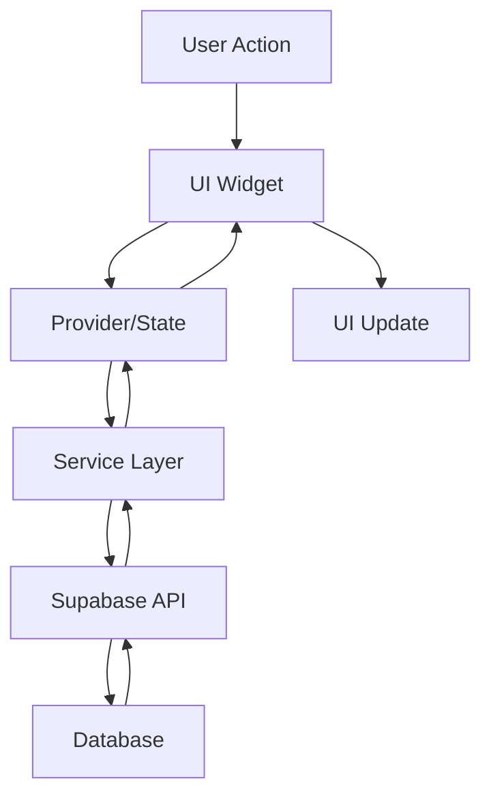

# Employee Setting Architecture Overview

## 🎯 Feature Summary

The Employee Setting page is a comprehensive salary management system that allows authorized users (admins, managers, owners) to view and manage employee compensation data within their organization.

## 🏗️ Architecture Pattern

We follow a **Clean Architecture** approach with:
- **Presentation Layer**: Pages, Widgets, State Management (Riverpod)
- **Domain Layer**: Models, Business Logic
- **Data Layer**: Services, Repositories, API/Database

## 📁 File Structure

```
lib/presentation/pages/employee_setting/
├── 📄 employee_setting_overview.md      # Feature documentation
├── 📄 ui_ux_specifications.md          # Design specifications  
├── 📄 backend_requirements.md          # API & database specs
├── 📄 implementation_plan.md           # Development roadmap
├── 📄 architecture_overview.md         # This file
│
├── employee_setting_page.dart          # Main page
├── models/
│   ├── employee_salary.dart           
│   ├── currency_type.dart
│   └── salary_update_request.dart
├── providers/
│   └── employee_setting_providers.dart 
├── services/
│   └── salary_service.dart
└── widgets/
    ├── employee_card.dart
    ├── salary_edit_sheet.dart
    └── employee_search_bar.dart
```

## 🔄 Data Flow



## 🎨 UI Components

### Core Widgets Used
- `TossScaffold` - Page container
- `TossAppBar` - Navigation header
- `TossSearchField` - Employee search
- `TossLoadingView` - Loading states
- `TossEmptyView` - Empty states
- `TossErrorView` - Error handling
- `TossBottomSheet` - Edit modal

### Custom Widgets
- `EmployeeCard` - Individual employee display
- `SalaryEditSheet` - Salary update form
- `EmployeeSearchBar` - Search with filters

## 🔌 State Management

### Providers Structure
```dart
// Main data provider
employeeSalaryListProvider → FutureProvider<List<EmployeeSalary>>

// Search functionality
employeeSearchQueryProvider → StateProvider<String>
filteredEmployeesProvider → Provider<List<EmployeeSalary>>

// Currency data
currencyTypesProvider → FutureProvider<List<CurrencyType>>

// Real-time updates
salaryUpdatesSubscription → StreamProvider<List<EmployeeSalary>>

// UI state
isLoadingProvider → StateProvider<bool>
selectedEmployeeProvider → StateProvider<EmployeeSalary?>
```

## 🗄️ Database Schema

### Tables
1. `users` - User profiles
2. `user_roles` - Role assignments
3. `user_salaries` - Salary records
4. `currency_types` - Currency definitions
5. `salary_history` - Change audit log

### Views
- `v_user_salary` - Combined employee salary data

### RPC Functions
- `update_user_salary` - Atomic salary update with history

## 🔐 Security

### Permission Levels
- **View**: Admin, Manager, Owner roles only
- **Edit**: Admin, Manager, Owner roles only
- **Delete**: Not allowed (soft delete only)

### Data Protection
- Row Level Security (RLS) policies
- Input validation and sanitization
- Audit trail for all changes
- Encrypted sensitive data

## 🚀 Performance Optimizations

### Client-Side
- Debounced search (300ms)
- Lazy loading with pagination
- Image caching for profiles
- Optimistic UI updates
- State persistence

### Server-Side
- Indexed database queries
- Efficient view materialization
- Connection pooling
- Query result caching

## 🧪 Testing Strategy

### Unit Tests
- Model serialization
- Provider logic
- Service methods
- Utility functions

### Widget Tests
- Component rendering
- User interactions
- State changes
- Error scenarios

### Integration Tests
- Full user flows
- API integration
- Real-time updates
- Permission checks

## 📱 Responsive Design

### Breakpoints
- Mobile: < 600px (default)
- Tablet: 600px - 1024px
- Desktop: > 1024px

### Adaptations
- Single column → Multi-column grid
- Bottom sheet → Side panel
- Touch targets → Hover states

## 🎯 Key Features

1. **Employee List View**
   - Profile display
   - Role information
   - Current salary
   - Quick edit access

2. **Search & Filter**
   - Real-time search
   - Role filtering
   - Store filtering
   - Sort options

3. **Salary Management**
   - Update amount
   - Change type (monthly/hourly)
   - Switch currency
   - Add notes

4. **Audit Trail**
   - Change history
   - Who made changes
   - When changes occurred
   - Previous values

## 🔗 Integration Points

### Internal Pages
- Dashboard → Navigate to Employee Setting
- Employee Profile → View detailed info
- Reports → Salary analytics

### External Services
- Supabase → Data storage
- Image CDN → Profile pictures
- Analytics → Usage tracking

## 📊 Success Metrics

### Performance KPIs
- Page load: < 2 seconds
- Search response: < 300ms
- Update operation: < 1 second

### User Experience KPIs
- Task completion: > 95%
- Error rate: < 1%
- User satisfaction: > 4.5/5

## 🚨 Error Handling

### User-Facing Errors
- Network failures → Retry options
- Permission denied → Clear messaging
- Invalid input → Inline validation
- Server errors → Fallback UI

### Developer Errors
- Type safety with Dart
- Null safety enforcement
- Comprehensive logging
- Error boundaries

## 🔄 Future Enhancements

### Phase 2
- Bulk salary updates
- Salary templates
- Export functionality
- Advanced filtering

### Phase 3
- Salary forecasting
- Budget integration
- Automated increases
- Multi-currency reports

## 📚 Resources

### Documentation
- [Flutter Riverpod](https://riverpod.dev/)
- [Supabase Flutter](https://supabase.com/docs/guides/with-flutter)
- [Toss Design System](internal-link)

### Tools
- Flutter DevTools
- Supabase Dashboard
- Sentry Error Tracking
- Firebase Analytics

---

**Last Updated**: ${new Date().toISOString()}
**Version**: 1.0.0
**Status**: Ready for Implementation